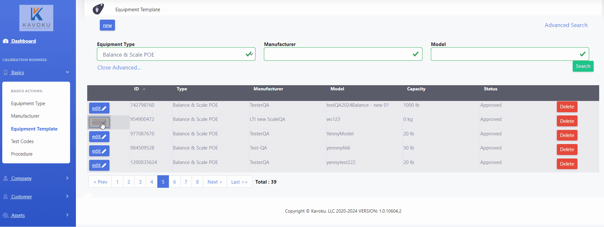

# Equiment Template

## Introduction

The Equipment Template module in CalSaaS is crucial for managing the core characteristics of equipment within your calibration company. Equipment Templates serve as the blueprint for individual pieces of equipment, dictating their main attributes based on the manufacturer and model. This ensures consistency and accuracy across all equipment managed within the system.

## Features Overview

## Equipment Template Create

1. Search a Equipment Type: : Find the type of equipment you want to create a template for.

2. Select Manufacturer: Choose the manufacturer of the equipment.

3. Select Status: Define the status of the equipment (e.g., Approved, Pending).

4. Add Device Class: Specify the device class for categorization.

5. Add Model: Enter the model number of the equipment.

6. Add Tolerance Type: If necessary, add the tolerance type based on the equipment type.

7. Add Test Points: Define test points depending on the equipment type.

 <a href="Components Equipment Template Create.mdx">Components (Basic Information, Tolerance and Resolution Information, Test Point, Uncertainty Attributes and Other Information)</a> 

---
##  Equipment Template Update 

Search ID/Model Equipment Template: Find the template you need to update.

Creating an Equipment Template
#### Search a Equipment Type:

Use the search functionality to find the specific type of equipment you want to create a template for.
1. Select Manufacturer: Choose the appropriate manufacturer from the dropdown list.
2. Select Status:Define the status of the equipment template (e.g., Approved, Pending).
3. Add Device Class:Specify the class to categorize the device appropriately.
4. Add Model: Enter the model number to uniquely identify the equipment.
5. Add Tolerance Type: If required, select and add the tolerance type depending on the equipment type.
6. Add Test Points: Define test points for calibration based on the equipment type

##### 
---
## Equipment Template Search 

* Search ID/Model Equipment Template in the filter: Locate templates using the ID or model.

#### 
---
## Equipment Template Delete

Search ID/Model Equipment Template

1. Search ID/Model Equipment Template: Find the template to delete.
2. Click on Delete Button: Remove the template from the system.

